<p align="center">
  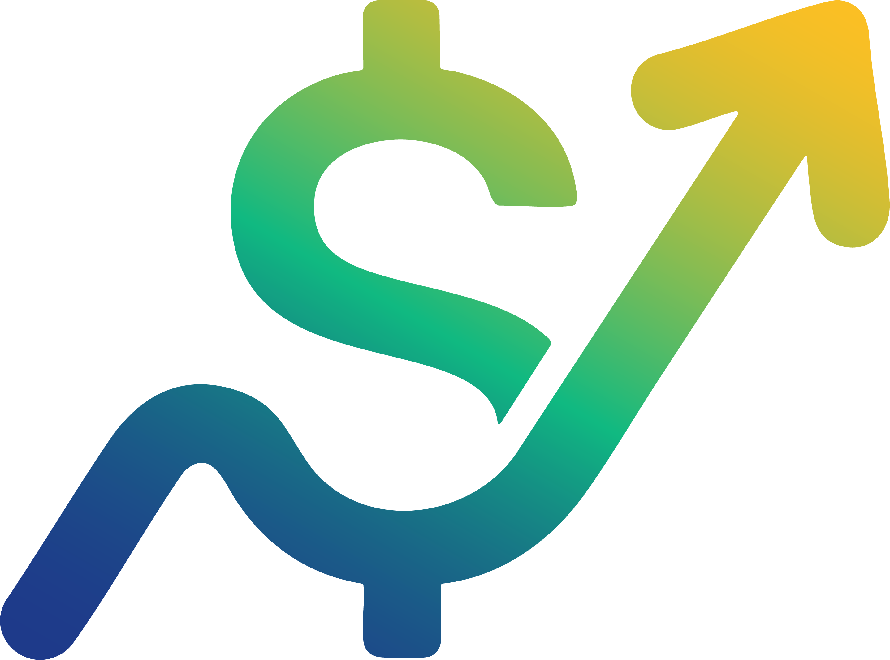<br>
  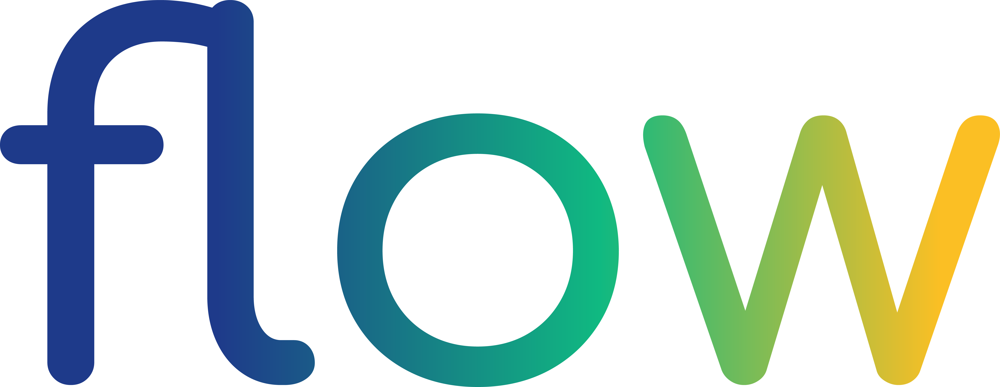
</p>

A self-hosted household finance app: bills, envelope-style budgeting,
debt payoff planning, net worth tracking, and savings goals — built around
automatic bank sync via [SimpleFIN](https://www.simplefin.org/).

<picture>
  <source media="(prefers-color-scheme: dark)" srcset="docs/screenshots/dashboard-dark.png">
  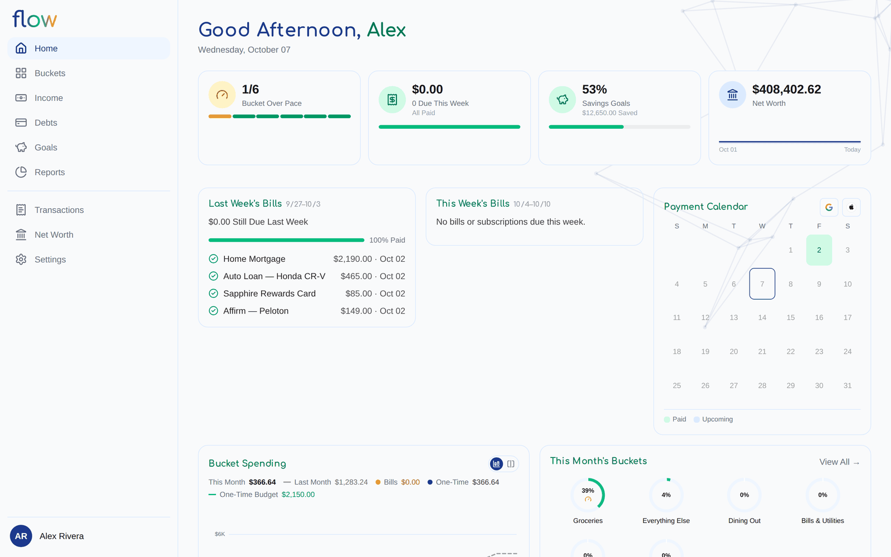
</picture>

## Screenshots

All screenshots are from Flow's built-in read-only example household
(fictional data) — the same one any instance offers from its login page.

| Buckets | Net Worth |
| --- | --- |
| 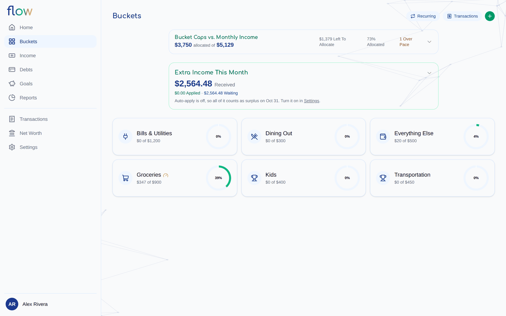 | 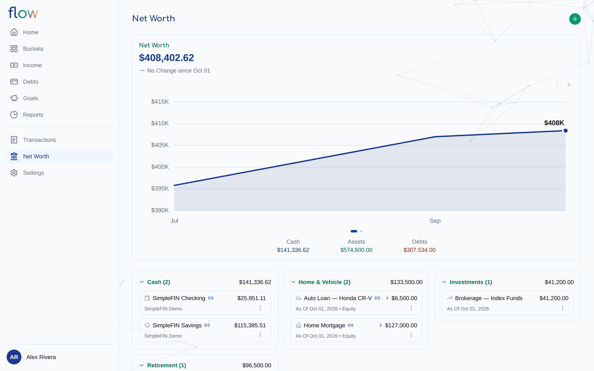 |
| **Debt Payoff Calendar** | **Payoff Projection** |
| 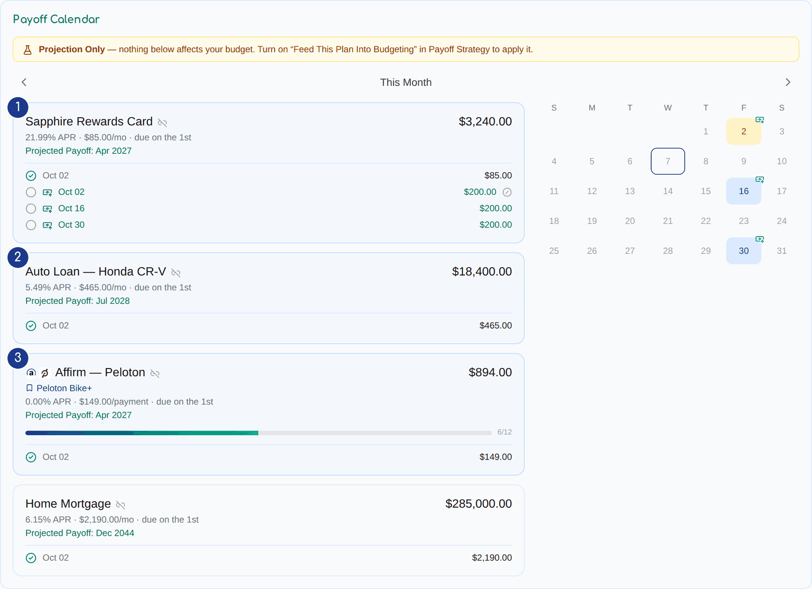 | 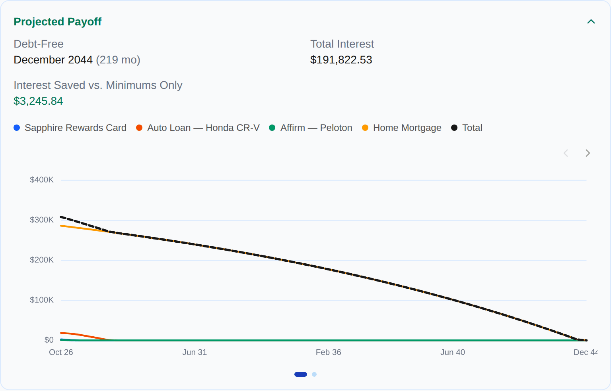 |
| **Monthly Report** | **Mobile** |
| 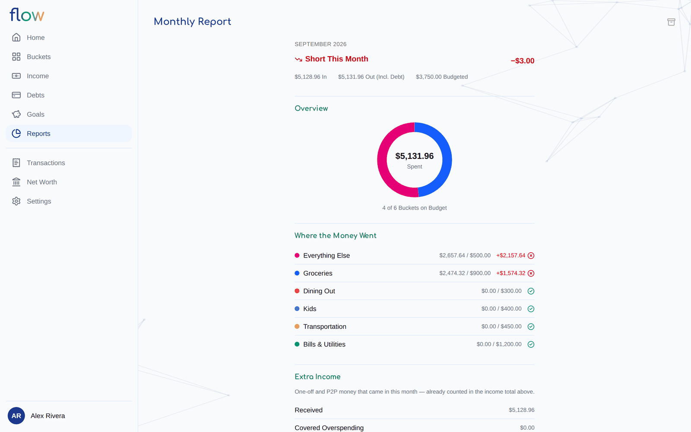 | 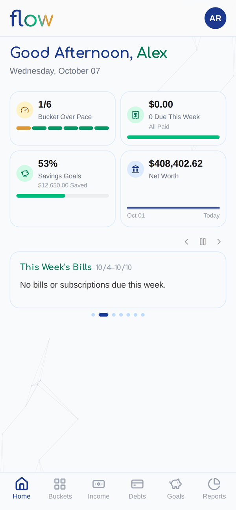 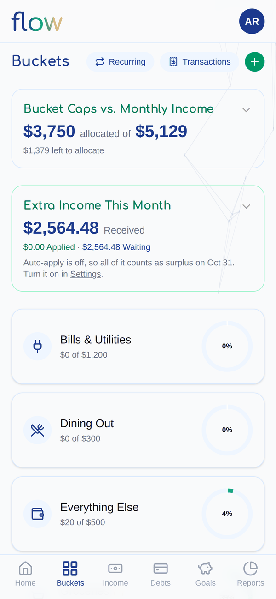 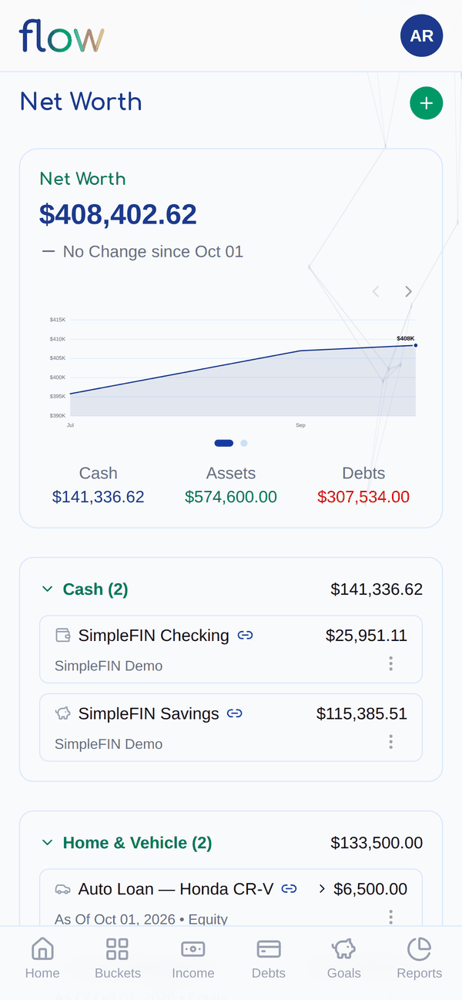 |

## Features

- **Bank sync** — [SimpleFIN](https://www.simplefin.org/) integration for
  automatic balance/transaction sync. Required, not optional: Flow has no
  manual transaction-entry screen, so every bill/bucket/spend feature below
  is driven off a connected SimpleFIN Bridge account. (Debts, assets, and
  savings goals can still be tracked manually if you'd rather not link
  them.)
- **Bills & recurring transactions** — auto-matches recurring bills/
  subscriptions by merchant, amount, and cadence; a this-week view of what's
  due; tolerance-aware amount matching so a bill that varies slightly month
  to month still tracks correctly.
- **Recurring pattern detection** — beyond plain bills, Flow recognizes and
  tracks recurring P2P transfers (Venmo/Zelle/Cash App/PayPal/Apple Cash)
  and Buy-Now-Pay-Later installment plans (Affirm, Klarna, Afterpay, etc.),
  including BNPL's fixed-installment-count payoff (unlike a bill, it stops
  once paid off rather than recurring forever).
- **Buckets** — envelope-style monthly budgeting with per-bucket pace
  tracking (flags a bucket that's spending faster than the month is
  passing), plus one-time-purchase savings buckets that accumulate toward a
  target instead of resetting every month.
- **Monthly budget planning** — each month Flow drafts a budget from your
  income, expected recurring charges (bills, debt minimums, scheduled P2P
  payments, expected reimbursements), and past spending; adjust the
  allocations with sliders and confirm, or (with AI assist on) have it
  redraft from plain-language instructions.
- **Income tracking** — detects recurring paychecks from synced deposits,
  shows what's expected this month (including biweekly third-paycheck
  months), and collects one-off and P2P money into an **Extra Income** pool
  that can cover bucket overspending or roll into month-end surplus.
- **Transactions** — every synced transaction in one searchable, filterable
  list, with bucket/category assignment, merchant routing rules, pending-
  vs-posted tracking, and linked receipts.
- **Debt payoff planner** — a payment calendar plus a payoff projection
  (debt-free date and interest saved vs. minimums only) across loans,
  cards, and BNPL, with a choice of avalanche/snowball/custom attack order,
  an extra-per-paycheck amount, rolling freed-up minimums into the next
  debt, and minimum-payment tracking. Optionally feeds the plan's extra
  payments into your budget, or keep it as a projection only.
- **Net worth & savings goals** — track assets (including estimated
  vehicle/home/crypto values) and liabilities, and progress toward savings
  targets with baseline tracking so an internal transfer into a linked
  account isn't mistaken for new savings.
- **Email receipt & bill-notice matching** — connect a read-only IMAP
  mailbox and Flow will parse order-confirmation emails and auto-attach
  them to the matching bank charge (with line items, when the email has
  them), and parse bill/statement emails to cross-check the amount you're
  tracking against what the biller actually says, flagging drift for
  review. Nothing is ever marked "read" or modified on the mailbox.
- **AI assist** — optional, bring-your-own API key (Gemini, OpenAI,
  Anthropic, or Grok), configured per household, and never required for
  anything to function — every AI call degrades gracefully to "leave it for
  a human" on failure or when unconfigured. Powers:
  - Bucket/category suggestions for uncategorized transactions and parsed
    receipts, plus one-click natural-language merchant routing rules
    ("put Amazon under $50 in Household, over $50 in Electronics").
  - Learning new recurring-merchant keywords over time (BNPL lenders,
    subscription services) on top of the built-in list, so a newly-seen
    lender is recognized automatically instead of needing a code change.
  - Parsing receipt/bill-notice emails into structured amounts/line items.
  - AI-written narrative for the monthly (and startup) financial
    reports — the report itself (in vs. out, spending by bucket against
    budget, extra income) works without AI, with PDF export and an archive
    of past months.
  - Redrafting the monthly budget from instructions ("put more toward the
    credit card, trim dining out"), with a per-bucket rationale.
  - Estimated vehicle/home value lookups for net worth, and suggested
    bucket icons/budget-plan allocations during onboarding.
- **Notifications & calendar sync** — Web Push (VAPID) reminders with
  granular per-category preferences (buckets, attention items, debts,
  savings, budget cycle), plus a subscribable ICS/webcal feed of bills,
  debt minimums, and the active payoff plan for any calendar app.
- **Multi-member households** — invite other members with owner/full/
  limited access levels; TOTP two-factor (required for owners) and passkey
  (WebAuthn) login.
- **Read-only example household** — an optional demo household reachable
  from the login page so prospective users can look around; every write is
  blocked server-side (`src/scripts/seed-demo.ts` seeds it).
- **Installable PWA** — responsive desktop + mobile layout, installable to
  a home screen/dock.

## Tech stack

Next.js (App Router) + TypeScript, Prisma + PostgreSQL, Docker.

## Running it

### Requirements

- Docker + Docker Compose

### Setup

1. Copy `.env.example` to `.env` and fill in the values (see the comments
   in that file for how to generate each secret).
2. Build and start Flow plus a Postgres container:

   ```bash
   docker compose up -d --build
   ```

   (`docker-entrypoint.sh` runs `prisma migrate deploy` on container start.)

3. Open [http://localhost:3000](http://localhost:3000).

The first account you create becomes the first household member; invite
others from Settings. Then connect a [SimpleFIN Bridge](https://beta-bridge.simplefin.org/)
account from **Settings → Account Sync** — there's no `.env` variable for
this, it's a setup token you paste in-app, and the app has little to show
until you do.

### Local development

```bash
npm install
npx prisma generate
npm run dev
```

Requires Node 22+ and a running Postgres reachable via `DATABASE_URL`.

## Tests

The pure-logic unit suite lives in `test/lib/*.test.ts` — no DB, no
network. With Node 22+, `npm ci && npx prisma generate && npm test` (CI runs
exactly that, plus typecheck and lint, on every pull request). Without a host
Node, `scripts/test.sh` runs it inside the built `flow-flow` image
(`docker compose build`). See [test/README.md](./test/README.md) for details
on running and writing tests.

## Security

Please report vulnerabilities privately — see [SECURITY.md](./SECURITY.md).

## License

[GNU AGPLv3](./LICENSE). If you run a modified version of Flow as a
network service, you must make your modified source available to its
users.
